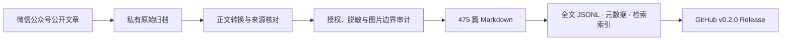

# 数字游戏学习研究 · 公众号全文知识库

<p align="center">
  
</p>

<p align="center">
  <a href="https://github.com/minkaiwang/dgbl-wechat-kb/actions/workflows/ci.yml"></a>
  · <a href="https://github.com/minkaiwang/dgbl-wechat-kb/releases/latest">下载最新数据集</a>
  · <a href="TEXT-LICENSE.md">CC BY-NC 4.0 正文许可</a>
  · <a href="docs/catalog.md">浏览 475 篇文章</a>
</p>

本仓库把“数字游戏学习研究”微信公众号的公开帖子整理为可追溯、可检索、可复现的**全文知识库**。
v0.2.0 收录公开合集位置 1–475 的 475 篇 Markdown 正文，并提供结构化全文 JSONL、元数据、
检索索引、质量报告和构建代码。每篇文章均保留稳定 ID、发布时间、作者网名“靓点迷人”和微信
原文链接。

> Release 的主体是公众号文章数据集与知识库；仓库中的脚本和 `dgbl-kb` skill 用于持续维护，
> 不作为这次 Release 的独立数据产品。公开正文不包含原始图片。

## 下载 v0.2.0

### 全文知识库

| 文件 | 适合用途 | 下载 |
|---|---|---|
| 全文 ZIP | 475 篇 Markdown、全文 JSONL、Schema、目录、许可和 Manifest | [下载全文 ZIP](https://github.com/minkaiwang/dgbl-wechat-kb/releases/download/v0.2.0/dgbl-wechat-fulltext-v0.2.0.zip) |
| 全文 JSONL | RAG、语义检索、主题分析与数据管道 | [下载全文 JSONL](https://github.com/minkaiwang/dgbl-wechat-kb/releases/download/v0.2.0/dgbl-wechat-fulltext-v0.2.0.jsonl) |
| 全文 Schema | 校验单条全文记录的字段与许可状态 | [下载全文 Schema](https://github.com/minkaiwang/dgbl-wechat-kb/releases/download/v0.2.0/dgbl-wechat-fulltext-v0.2.0.schema.json) |

### 轻量元数据

| 文件 | 适合用途 | 下载 |
|---|---|---|
| 元数据 ZIP | 一次取得 JSONL、CSV、Schema、许可和 Manifest | [下载元数据 ZIP](https://github.com/minkaiwang/dgbl-wechat-kb/releases/download/v0.2.0/dgbl-wechat-metadata-v0.2.0.zip) |
| 元数据 JSONL | 知识图谱、目录服务与程序处理 | [下载 JSONL](https://github.com/minkaiwang/dgbl-wechat-kb/releases/download/v0.2.0/dgbl-wechat-metadata-v0.2.0.jsonl) |
| 元数据 CSV | Excel、SPSS/R 前期整理与人工浏览 | [下载 CSV](https://github.com/minkaiwang/dgbl-wechat-kb/releases/download/v0.2.0/dgbl-wechat-metadata-v0.2.0.csv) |
| 元数据 Schema | 字段约束与二次开发 | [下载 Schema](https://github.com/minkaiwang/dgbl-wechat-kb/releases/download/v0.2.0/dgbl-wechat-metadata-v0.2.0.schema.json) |

全部 7 个数据资产可用
[SHA256SUMS.txt](https://github.com/minkaiwang/dgbl-wechat-kb/releases/download/v0.2.0/SHA256SUMS.txt)
核验完整性。仓库尚未发布 v0.2.0 前，上述链接会暂时返回 404。

## 数据概览

| 指标 | v0.2.0 |
|---|---:|
| Markdown 全文 | 475 篇 |
| 公开合集位置 | 1–475，连续 |
| 发布时间范围 | 2024-07-11 至 2026-08-14 |
| Markdown 文件总规模 | 约 5.93 MB |
| 去重图像源 / 图像出现位置 | 7,168 / 14,334 |
| 公开原图 | 0 |
| 重复稳定 ID / URL | 0 / 0 |
| 自动 QA 待复核 | 0 |

文章中的图片全部转换为文字占位符。`image_count` 表示文章内去重后的图像源数量，
`image_occurrence_count` 表示正文中实际出现位置数量，两者含义不同。

## 从公众号到开放知识库



原始 HTML、接口响应和原图留在私有归档；公开仓库只接收通过许可、隐私与内容门禁的文字、
索引和审计材料。

## 仓库结构

```text
docs/articles/                 475 篇按年份组织的 Markdown 正文
docs/catalog.md                可点击的全文目录
docs/llms.txt                  面向检索代理的轻量索引
data/articles.jsonl            含路径、摘要片段和审计字段的机器索引
data/article-metadata.jsonl    不含正文的轻量公开元数据
data/article-fulltext.schema.json
reports/                       完整性、权利、脱敏与发布审计
scripts/                       导入、构建、搜索、QA 与 Release 工具
```

## 单条元数据示例

```json
{
  "schema_version": 2,
  "article_id": "wx-2247484000-1",
  "position": 1,
  "author": "靓点迷人",
  "licensor": "靓点迷人",
  "content_rights": "CC-BY-NC-4.0",
  "content_license_url": "https://creativecommons.org/licenses/by-nc/4.0/",
  "asset_rights": "pending_review"
}
```

全文 JSONL 另含 `body_markdown`、`markdown_path`、`tags`、`text_chars`、`image_count` 和
`image_occurrence_count`。完整定义见[数据集说明](docs/dataset.md)。

## 许可边界

| 内容 | 许可 / 状态 |
|---|---|
| 475 篇文章中“靓点迷人”创作的原创文字 | [CC BY-NC 4.0](TEXT-LICENSE.md) |
| 公开元数据、项目说明和自主审计材料 | [CC BY 4.0](DATA-LICENSE.md) |
| 软件代码 | [MIT License](LICENSE) |
| 原图、论文图表、期刊封面、照片及其他第三方素材 | 不随正文再许可；未进入公开仓库 |

引用单篇文章时，请署名“靓点迷人”，保留 CC BY-NC 4.0 链接、仓库链接与该页
`source_url`，并标明是否修改。具体口径见 [`RIGHTS.md`](RIGHTS.md)。

## 完整性边界

用户提供的主页截图显示 486 篇原创内容，截图同期公开合集为 474 篇，历史差额为 12 篇。
此后新增编号 483，当前合集为 475 篇；主页总数尚未重新截图，因此本版本只声明完整覆盖已发现的
公开合集 1–475，不声明覆盖账号后台的全部原创内容。编号 3、94、435 仍待后台清单核对，
356–364 高度疑似一次性编号跳号。证据见
[`reports/completeness-reconciliation.md`](reports/completeness-reconciliation.md)。

## 复现与验证

```powershell
git clone https://github.com/minkaiwang/dgbl-wechat-kb.git
cd dgbl-wechat-kb
uv sync --frozen --python 3.12 --extra test
uv run ruff check .
uv run pytest
uv run python scripts/validate_public_release.py --history
uv run python scripts/build_release_assets.py --output dist --version 0.2.0
$env:NO_MKDOCS_2_WARNING='true'; uv run mkdocs build --strict
```

Release 资产采用确定性构建；同一版本和输入应生成相同的 JSONL、CSV、Schema、ZIP 与 SHA256。
贡献规则见 [`CONTRIBUTING.md`](CONTRIBUTING.md)，机器可读引用信息见
[`CITATION.cff`](CITATION.cff)。
