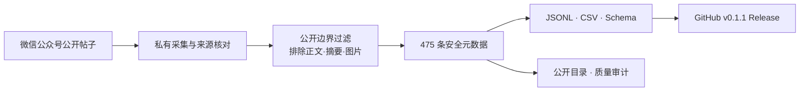

# 数字游戏学习研究 · 公众号公开元数据集

<p align="center">
  
</p>

<p align="center">
  <a href="https://github.com/minkaiwang/dgbl-wechat-kb/actions/workflows/ci.yml"></a>
  · <a href="https://github.com/minkaiwang/dgbl-wechat-kb/releases/latest">下载最新数据集</a>
  · <a href="DATA-LICENSE.md">CC BY 4.0 元数据许可</a>
  · <a href="docs/catalog-public.md">浏览公开目录</a>
</p>

本仓库把“数字游戏学习研究”微信公众号的公开帖子整理为**可追溯元数据集与知识库框架**。
当前正式数据版本收录 475 条帖子元数据，每条记录均保留稳定 ID、原始标题、发布日期、栏目、
作者字段和微信原文链接，便于检索、核验与后续研究复用。

> 当前开放的是“帖子元数据”，不是 475 篇文章全文。正文、摘要片段、原始 HTML 和图片均未进入
> Git 历史或 Release。

## 下载 v0.1.1

| 文件 | 适合用途 | 下载 |
|---|---|---|
| 完整 ZIP 数据包 | 一次取得数据、Schema、Manifest、许可与说明 | [下载 ZIP](https://github.com/minkaiwang/dgbl-wechat-kb/releases/download/v0.1.1/dgbl-wechat-metadata-v0.1.1.zip) |
| JSONL | Python、知识图谱、数据管道与 AI 检索 | [下载 JSONL](https://github.com/minkaiwang/dgbl-wechat-kb/releases/download/v0.1.1/dgbl-wechat-metadata-v0.1.1.jsonl) |
| CSV（UTF-8 BOM） | Excel、SPSS/R 前期整理与人工浏览 | [下载 CSV](https://github.com/minkaiwang/dgbl-wechat-kb/releases/download/v0.1.1/dgbl-wechat-metadata-v0.1.1.csv) |
| JSON Schema | 字段约束、自动验证与二次开发 | [下载 Schema](https://github.com/minkaiwang/dgbl-wechat-kb/releases/download/v0.1.1/dgbl-wechat-metadata-v0.1.1.schema.json) |
| SHA256 校验和 | 下载完整性核验 | [下载校验和](https://github.com/minkaiwang/dgbl-wechat-kb/releases/download/v0.1.1/SHA256SUMS.txt) |

字段定义、编码方式与使用边界见[数据集说明](docs/dataset.md)。

## 数据概览

| 指标 | 当前值 |
|---|---:|
| 公开元数据记录 | 475 条 |
| 公开合集位置 | 1–475，连续 |
| 发布时间范围 | 2024-07-11 至 2026-08-14 |
| 原始栏目标签 | 26 种 |
| 重复稳定 ID / URL | 0 / 0 |
| 正文、摘要、图片 | 0 |

用户提供的主页截图显示 486 篇原创内容，截图同期公开合集为 474 篇，历史差额为 12 篇。
此后新增编号 483，当前合集为 475 篇；主页总数尚未重新截图，因此不计算异步差额。编号
3、94、435 未决；356–364 高度疑似一次性编号跳号。完整证据见
[`reports/completeness-reconciliation.md`](reports/completeness-reconciliation.md)。

## 从帖子到开放数据



公开数据可以支持帖子目录检索、主题线索发现、发布节奏分析、候选文献回溯和知识图谱入口构建。
需要全文语义分析时，应通过 `source_url` 回到微信原文，并另行确认正文与图片的使用权限。

## 单条记录示例

```json
{
  "schema_version": 1,
  "article_id": "wx-2247484000-1",
  "position": 1,
  "issue_no": 1,
  "series": "数字游戏学习",
  "published_at": "2024-07-11T17:33:47+08:00",
  "content_rights": "pending_owner_review",
  "asset_rights": "pending_review"
}
```

完整记录还包括 `title`、`display_title`、`author` 和 `source_url`。JSONL 的单条记录约束见
[`data/article-metadata.schema.json`](data/article-metadata.schema.json)。

## 公开边界

| 内容 | GitHub / Release 状态 |
|---|---|
| 标题、日期、栏目、稳定 ID、作者字段、原文链接 | 公开 |
| 导入状态、质量报告、权利状态与处理代码 | 公开 |
| 475 篇本地 Markdown 正文 | 不提交 |
| 全文索引、正文摘要片段与 `llms.txt` | 不提交 |
| 原始 HTML、原图、接口快照、Cookie 和日志 | 仅存维护者私有归档 |

`.gitignore`、`scripts/validate_public_release.py` 和 GitHub Actions 对该边界实施三重检查。

## 复现与验证

```powershell
git clone https://github.com/minkaiwang/dgbl-wechat-kb.git
cd dgbl-wechat-kb
uv sync --frozen --python 3.12 --extra test
uv run ruff check .
uv run pytest
uv run python scripts/build_release_assets.py --output dist
uv run python scripts/validate_public_release.py --history
$env:NO_MKDOCS_2_WARNING='true'; uv run mkdocs build --strict
```

Release 数据包由脚本确定性生成：同一版本与输入会得到相同的 JSONL、CSV、Schema、ZIP 和
SHA256 校验和。

## 许可与引用

- 软件代码：根目录 [`LICENSE`](LICENSE) 中的 MIT License。
- 公开元数据、信息图、目录、报告和项目文档：[`DATA-LICENSE.md`](DATA-LICENSE.md) 中的 CC BY 4.0。
- 微信文章正文、摘要片段、图片和第三方材料：不在上述开放许可范围内。

引用本数据集时可使用 [`CITATION.cff`](CITATION.cff)。贡献规则见
[`CONTRIBUTING.md`](CONTRIBUTING.md)，权利边界见 [`RIGHTS.md`](RIGHTS.md)。
