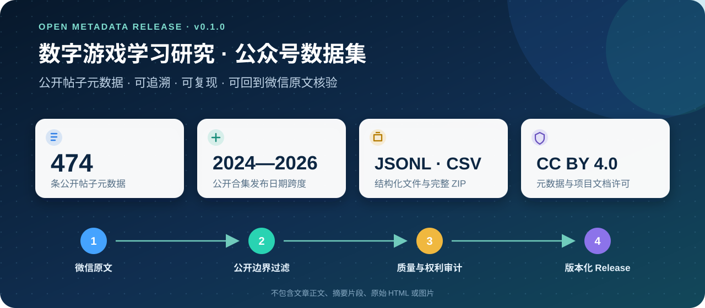

# 数字游戏学习研究 · 公众号知识库

这里整理“数字游戏学习研究”公众号的公开文章。每条元数据保留原始标题、发布时间和微信原文链接，便于核验。

维护者的本地工作区已完成公开合集 475 篇正文的导入与质量检查。当前 GitHub 公开版本仅包含
代码和 475 条元数据，不包含正文、摘要片段或图片。用户提供的主页截图与同期 474 篇合集之间
存在 12 篇历史差额；编号 483 发布后的主页总数尚未重新核验，仍需后台清单或人工对账。

## 使用方式

- 使用顶部搜索框检索公开目录中的标题和栏目。
- 从标签页进入数字游戏学习、游戏化学习、教育元宇宙、桌面游戏等专题。
- 引用元数据时必须同时给出文章标题、日期和微信原文链接。

公开元数据与本站项目文档采用 CC BY 4.0；微信文章正文和图片不在该许可范围内。
